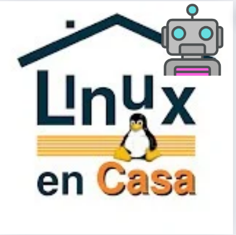

# Tux bot



## How to setup

first, clone the repo with the following command

```bash
git clone https://github.com/Ferchupessoadev/tux-bot
```

then, create a virtual environment with the following commands and install the dependencies

```bash
cd tux-bot
python3 -m venv .venv
source .venv/bin/activate
pip install -r requirements.txt
```

then, create a config file with the following command

```bash
cp .env.example .env
```

then, edit the config file with your own values

finally, run the bot with the following commands

```bash
cd src
python index.py
```
